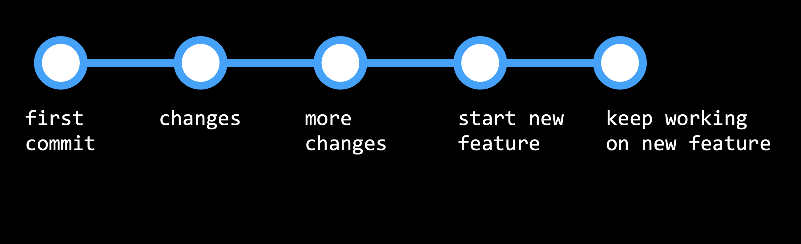
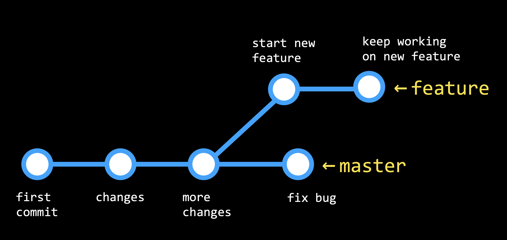
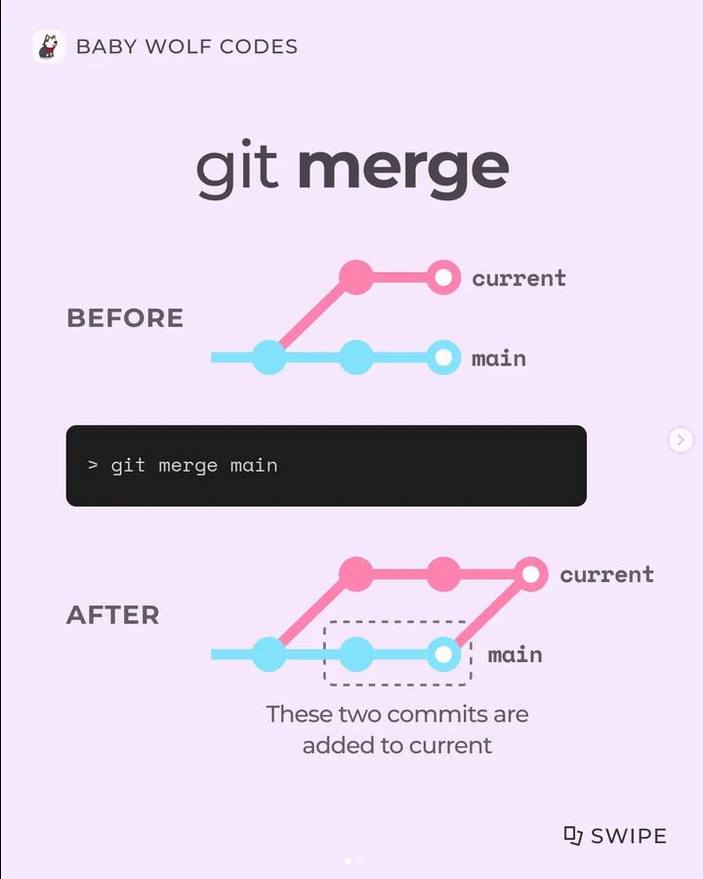
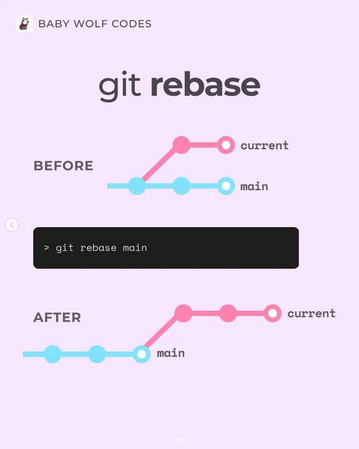

# Branching

* หลังจากที่คุณทำงานในโครงการมาระยะหนึ่งแล้ว คุณอาจตัดสินใจว่าต้องการเพิ่มฟีเจอร์เพิ่มเติม ในขณะนี้ เราอาจยอมรับการเปลี่ยนแปลงคุณลักษณะใหม่นี้ดังที่แสดงในภาพด้านล่าง

<figure><figcaption></figcaption></figure>

แต่นี่อาจกลายเป็นปัญหาถ้าเราพบบั๊กในรหัสต้นฉบับและต้องการย้อนกลับมาโดยไม่ต้องเปลี่ยนแปลงความสามารถใหม่ นี่คือจุดที่การสร้าง branch จะเป็นประโยชน์อย่างมาก

การสร้าง branch คือวิธีการเลือกทิศทางใหม่เมื่อสร้างความสามารถใหม่ และจะรวมความสามารถใหม่นี้กับส่วนหลักของรหัสหรือ branch หลักเมื่อเสร็จสิ้นเท่านั้น ดังนั้นเวิร์กโฟลว์จะดูเหมือนกราฟด้านล่างนี้:

<figure><figcaption></figcaption></figure>

Branch ที่คุณกำลังมองอยู่จะถูกกำหนดโดย HEAD ซึ่งชี้ไปยังสาขาหนึ่งในสองสาขา โดยค่าเริ่มต้น HEAD จะชี้ไปยัง master branch แต่เราสามารถเช็คเอาท์สาขาอื่น ๆ ได้อีกด้วย

ตอนนี้เรามาเข้าสู่กระบวนการที่จะใช้ Branch ใน Git repositories กันดีกว่า:

1.  ใช้คำสั่ง git branch เพื่อดู branch ที่คุณกำลังทำงานอยู่ ซึ่งจะมีเครื่องหมายดอกจัน (\*) ไว้ด้านซ้ายของชื่อ branch&#x20;

    <figure><figcaption></figcaption></figure>
2.  ในการสร้าง branch ใหม่ ให้ใช้คำสั่ง git checkout -b <ชื่อ branch ใหม่>&#x20;

    <figure><figcaption></figcaption></figure>
3. เพื่อเปลี่ยน branch ให้ใช้คำสั่ง git checkout <ชื่อ branch> และ commit การเปลี่ยนแปลงในแต่ละ branch
4. เมื่อเราพร้อมที่จะรวมสอง branch ด้วยกัน เราจะ checkout branch ที่เราต้องการเก็บรักษา (โดยปกติแล้วจะเป็น master branch) แล้วใช้คำสั่ง git merge <ชื่อ branch อื่น> เพื่อรวมการเปลี่ยนแปลง การรวมนี้จะถูกจัดการเหมือน push หรือ pull และอาจมีข้อขัดแย้งในการรวม (merge conflicts) อาจเกิดขึ้นได้

<figure><figcaption>
Credit @baby_wolf_codes
</figcaption></figure>

<figure><figcaption>
Credit @baby_wolf_codes
</figcaption></figure>

