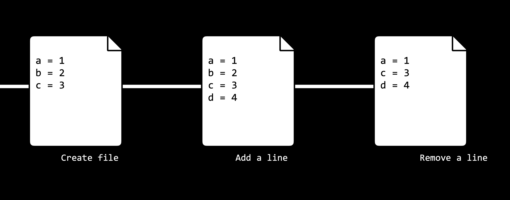
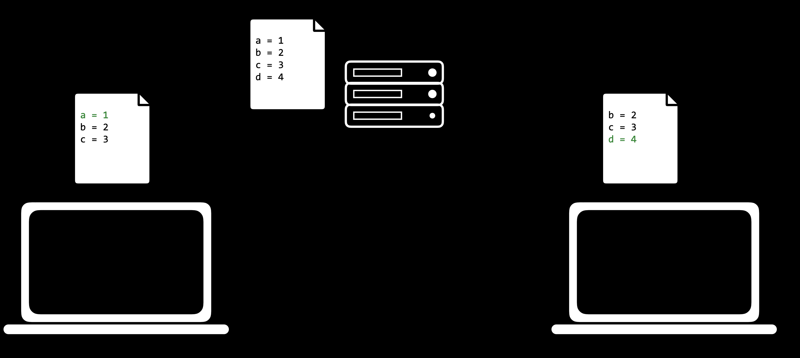

# Git

[Git](https://git-scm.com/) เป็นเครื่องมือคำสั่งที่จะช่วยเราในการควบคุมเวอร์ชันในหลายวิธี:

* ทำให้เราสามารถติดตามการเปลี่ยนแปลงที่เราทำกับโค้ดของเราโดยการบันทึกสแนปชอตของโค้ด ณ เวลาที่กำหนด

<figure><figcaption></figcaption></figure>

* ทำให้เราสามารถซิงโครไนซ์โค้ดระหว่างบุคคลต่างๆ ที่ทำงานในโครงการเดียวกันได้อย่างง่ายดาย โดยอนุญาตให้บุคคลหลายคนดึงข้อมูลจากและพุชข้อมูลไปยังที่เก็บที่จัดเก็บไว้ในเว็บ

<figure><figcaption></figcaption></figure>

* ทำให้เราสามารถเปลี่ยนแปลงและทดสอบโค้ดในสาขา _(branch)_ อื่น ได้โดยไม่ต้องแก้ไขฐานโค้ดหลักของเรา จากนั้นจึงรวมโค้ดทั้งสองเข้าด้วยกัน
* ทำให้เราสามารถย้อนกลับไปใช้โค้ดเวอร์ชันก่อนหน้าได้ หากเราตระหนักว่าเราทำผิดพลาด

ในคำอธิบายข้างต้น เราใช้คำว่า **repository**, ที่เรายังไม่ได้อธิบาย. Git repositoryคือตำแหน่งไฟล์ที่เราจะเก็บไฟล์ทั้งหมดที่เกี่ยวข้องกับโปรเจ็กต์ที่กำหนด. สิ่งเหล่านี้สามารถเป็นได้ทั้งแบบรีโมต (จัดเก็บออนไลน์) หรือแบบโลคัล (จัดเก็บไว้ในคอมพิวเตอร์ของคุณ)

