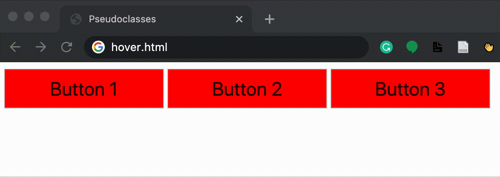

# CSS (Cascading Style Sheets)

* CSS ใช้เพื่อปรับแต่งรูปลักษณ์ของเว็บไซต์
* ในขณะที่เราเพิ่งเริ่มต้น เราสามารถเพิ่มแอตทริบิวต์สไตล์ให้กับองค์ประกอบ HTML ใดก็ได้ เพื่อใช้ CSS บางส่วนกับองค์ประกอบนั้น
* เราเปลี่ยนรูปแบบโดยแก้ไขคุณสมบัติ CSS ขององค์ประกอบ color: blue หรือ text-align: center
* ในตัวอย่างนี้ด้านล่าง เราทำการเปลี่ยนแปลงเล็กน้อยกับไฟล์แรกของเราเพื่อให้มีหัวเรื่องที่มีสีสัน:

````html
<!DOCTYPE html>
<html lang="en">
  <head>
    <title>Hello</title>
  </head>
  <body>
    <h1 style="color:blue; text-align:center"> A Colorful Heading!</h1>
    Hello world
  </body>
</html>
```
````

<figure><figcaption></figcaption></figure>

* หากเราจัดรูปแบบองค์ประกอบภายนอก องค์ประกอบภายในทั้งหมดจะใช้รูปแบบนั้นโดยอัตโนมัติ เราจะเห็นสิ่งนี้หากเราย้ายสไตล์ที่เราเพิ่งใช้จากแท็ก body ไปยังแท็กเนื้อหา:

```html
<!DOCTYPE html>
<html lang="en">
    <head>
        <title>Hello!</title>
    </head>
    <body style="color: blue; text-align: center;">
        <h1 >A Colorful Heading!</h1>
        Hello, world!
    </body>
<html>
```

<figure><figcaption></figcaption></figure>

* แม้ว่าเราจะสามารถจัดรูปแบบหน้าเว็บของเราได้ตามที่เราได้ทำไว้ข้างต้น แต่เพื่อให้ได้การออกแบบที่ดีขึ้น เราควรจะสามารถย้ายสไตล์ของเราออกจากบรรทัดแต่ละบรรทัดได้
  * วิธีหนึ่งในการทำเช่นนี้คือเพิ่มสไตล์ของคุณระหว่างแท็ก \<style> ในส่วนหัว ภายในแท็กเหล่านี้ เราเขียนว่าองค์ประกอบประเภทใดที่เราต้องการให้เป็นสไตล์ และสไตล์ที่เราต้องการนำไปใช้กับองค์ประกอบเหล่านั้น ตัวอย่างเช่น:

```html
  <html lang="en">
  <!DOCTYPE html>
  <head>
      <title>Hello!</title>
      <style>
          h1 {
              color: blue;
              text-align: center;
          }
      </style>
  </head>
  <body>
      <h1 >A Colorful Heading!</h1>
      Hello, world!
  </body>
  </html>
```

* อีกวิธีหนึ่งคือการรวมองค์ประกอบ ในส่วนหัวของคุณด้วยลิงก์ไปยังไฟล์ style.css ที่มีสไตล์บางอย่าง ซึ่งหมายความว่าไฟล์ HTML จะมีลักษณะดังนี้:

```html
<html lang="en">
  <!DOCTYPE html>
  <head>
      <title>Hello!</title>
      <link rel="stylesheet" href="styles.css">
  </head>
  <body>
      <h1 >A Colorful Heading!</h1>
      Hello, world!
  </body>
  </html>
```

* และไฟล์ของเราที่ชื่อ style.css จะมีลักษณะดังนี้:

```css
  h1 {
      color: blue;
      text-align: center;
  }
```

* มีคุณสมบัติ CSS มากเกินไปที่จะกล่าวถึงหมดที่นี่ แต่เช่นเดียวกับองค์ประกอบ HTML โดยทั่วไปแล้วค้นหาด้วย Google จะทำได้ง่าย หรือใช้ ChatGPT ก็ง่ายมากๆ เช่น "change font to blue CSS" เพื่อให้ได้ผลลัพธ์ สิ่งที่พบได้บ่อยที่สุดคือ:
  * `color:` สีของข้อความ
  * `text-align:` ตำแหน่งที่วางองค์ประกอบบนหน้าเพจ
  * `background-color`: สามารถตั้งค่าเป็นสีใดก็ได้
  * `width`: เป็นพิกเซลหรือเปอร์เซ็นต์ของหน้า
  * `height`: เป็นพิกเซลหรือเปอร์เซ็นต์ของหน้า
  * `padding`: ควรเหลือพื้นที่ว่างภายในองค์ประกอบเท่าใด
  * `margin`: ควรเหลือพื้นที่ว่างไว้ด้านนอกองค์ประกอบเท่าใด
  * `font-family`: ประเภทของแบบอักษรสำหรับข้อความในหน้า
  * `font-size`: เป็นพิกเซล
  * `border`: ชนิดขนาด (ทึบ เส้นประ ฯลฯ) สี
* ลองใช้สิ่งที่เราเพิ่งเรียนรู้เพื่อปรับปรุง ตารางมหาสมุทรของเราจากด้านบน นี่คือ HTML บางส่วนที่จะเริ่มต้น:

```html
<!DOCTYPE html>
<html lang="en">
    <head>
        <title>Nicer Table</title>
    </head>
    <body>
        <table>
            <thead>
                <th>Ocean</th>
                <th>Average Depth</th>
                <th>Maximum Depth</th>
            </thead>
            <tbody>
                <tr>
                    <td>Pacific</td>
                    <td>4280 m</td>
                    <td>10911 m</td>
                </tr>
                <tr>
                    <td>Atlantic</td>
                    <td>3646 m</td>
                    <td>8486 m</td>
                </tr>
            </tbody>
        </table>
    </body>
<html>
```

<figure><figcaption></figcaption></figure>

* ด้านบนดูเหมือนสิ่งที่เรามีก่อนหน้านี้มาก แต่ตอนนี้ไม่ว่าจะใส่แท็กสไตล์หรือลิงก์ไปยังสไตล์ชีตในองค์ประกอบส่วน head เราก็เพิ่ม css ต่อไปนี้:

```css
table {
    border: 1px solid black;
    border-collapse: collapse;
}

td {
    border: 1px solid black;
    padding: 2px;
}

th {
    border: 1px solid black;
    padding: 2px;
}
```

<figure><figcaption></figcaption></figure>

* คุณอาจคิดว่ามีการซ้ำซ้อนโดยไม่จำเป็นใน CSS ของเราในขณะนี้ เนื่องจาก td และ th มีรูปแบบเหมือนกัน เราสามารถ (และควร) ย่อสิ่งนี้ลงในโค้ดต่อไปนี้ โดยใช้เครื่องหมายจุลภาคเพื่อแสดงสไตล์ควรใช้กับองค์ประกอบมากกว่าหนึ่งประเภท

```css
table {
    border: 1px solid black;
    border-collapse: collapse;
}

td, th {
    border: 1px solid black;
    padding: 2px;
}
```

\
นี่เป็นการแนะนำที่ดีเกี่ยวกับสิ่งที่เรียกว่า [CSS selectors](https://www.w3schools.com/cssref/css\_selectors.asp). Tต่อไปนี้เป็นหลายวิธีในการพิจารณาว่าคุณกำลังจัดรูปแบบองค์ประกอบ HTML ใด ซึ่งบางวิธีเราจะกล่าวถึงที่นี่:

* **element type**:นี่คือสิ่งที่เราทำมาตลอด: จัดรูปแบบองค์ประกอบทั้งหมดให้เป็นประเภทเดียวกัน
* **id**: อีกทางเลือกหนึ่งคือการให้ id องค์ประกอบ HTML ของเรา: `<h1 id="first-header">Hello!</h1>` แล้วจัดแต่งสไตล์โดยใช้ `#first-header{...}` ใช้แฮชแท็กเพื่อแสดงว่าเรากำลังค้นหาด้วย id. ที่สำคัญ ไม่มีสององค์ประกอบที่สามารถมี id เดียวกันได้ และไม่มีองค์ประกอบใดที่สามารถมีมากกว่า 1 id ได้
* **class**: สิ่งนี้คล้ายกับ id แต่คลาสสามารถแชร์ได้มากกว่าหนึ่งองค์ประกอบ และองค์ประกอบเดียวสามารถมีมากกว่าหนึ่งคลาส เราเพิ่มคลาสให้กับองค์ประกอบ HTML ดังนี้: `<h1 class="page-text muted">Hello!</h1>` (โปรดทราบว่าเราเพิ่งเพิ่มสองคลาสในองค์ประกอบ: `page-text` และ `muted`). Wจากนั้นจัดรูปแบบตามคลาสโดยใช้จุดแทนแฮชแท็ก: `.muted {...}`

ตอนนี้เราต้องจัดการกับปัญหาของ CSS ที่อาจขัดแย้งกัน จะเกิดอะไรขึ้นเมื่อส่วนหัวควรเป็นสีแดงตามคลาสแต่เป็นสีน้ำเงินตาม id CSS มีลำดับเฉพาะทำงานดังนี้:

1. In-line styling
2. id
3. class
4. element type

นอกจากเครื่องหมายจุลภาคสำหรับตัวเลือกหลายตัวแล้ว ยังมีวิธีอื่นๆ อีกหลายวิธีในการระบุองค์ประกอบที่คุณต้องการจัดรูปแบบ ตารางนี้จากการบรรยายมีบางส่วน และเราจะอธิบายตัวอย่างด้านล่าง:

| รูปแบบ | ความหมาย                     |
| ------ | ---------------------------- |
| a, b   | ตัวเลือกองค์ประกอบหลายรายการ |
| a b    | ตัวเลือกลูกหลาน              |
| a > b  | ตัวเลือกลูก                  |
| a + b  | ตัวเลือกพี่น้องที่อยู่ติดกัน |
| \[a=b] | ตัวเลือกแอตทริบิวต์          |
| a:b    | ตัวเลือก Pseudoclass         |
| a::b   | ตัวเลือก Pseudoelement       |

**Descendant Selector (ตัวเลือกลูกหลาน)**: ที่นี่ เราใช้ตัวเลือกลูกหลานเพื่อใช้สไตล์กับรายการที่พบในรายการที่ไม่มีลำดับเท่านั้น:

```html
<!DOCTYPE html>
<html lang="en">
    <head>
        <title>Using Selectors</title>
        <style>
            ul li {
                color: blue;
            }
        </style>
    </head>
    <body>
        <ol>
            <li>foo</li>
            <li> bar
                <ul>
                    <li>hello</li>
                    <li>goodbye</li>
                    <li>hello</li>
                </ul>
            </li>
            <li>baz</li>
        </ol>

    </body>
<html>
```

<figure><figcaption></figcaption></figure>

**Attributes as Selectors (**ตัวเลือกแอตทริบิวต์**)**: นอกจากนี้ เรายังสามารถจำกัดการเลือกให้แคบลงตามแอตทริบิวต์ที่เรากำหนดให้กับองค์ประกอบ HTML โดยใช้วงเล็บเหลี่ยม ตัวอย่างเช่น ในรายการลิงก์ต่อไปนี้ เราเลือกที่จะทำให้ลิงก์ไปยัง Amazon เป็นสีแดงเท่านั้น:

```html
<!DOCTYPE html>
<html lang="en">
    <head>
        <title>Using Selectors</title>
        <style>
            a[href="https://www.amazon.com/"] {
                color: red;
            }
        </style>
    </head>
    <body>
        <ol>
            <li><a href="https://www.google.com/">Google</a></li>
            <li><a href="https://www.amazon.com/">Amazon</a> </li>
            <li><a href="https://www.facebook.com/">Facebook</a></li>
        </ol>

    </body>
<html>
```

<figure><figcaption></figcaption></figure>

* ไม่เพียงแต่เราสามารถใช้ CSS เพื่อเปลี่ยนรูปลักษณ์ขององค์ประกอบอย่างถาวร แต่ยังรวมถึงรูปลักษณ์ของมันภายใต้เงื่อนไขบางประการด้วย ตัวอย่างเช่น จะทำอย่างไรถ้าเราต้องการให้ปุ่มเปลี่ยนสีเมื่อเราวางเมาส์เหนือปุ่มนั้น เราสามารถทำได้โดยใช้ [CSS pseudoclass](https://www.w3schools.com/css/css\_pseudo\_classes.asp), ซึ่งให้สไตล์เพิ่มเติมในสถานการณ์พิเศษ เราเขียนสิ่งนี้โดยเพิ่มเครื่องหมายจุดคู่หลังตัวเลือกของเรา แล้วจึงเพิ่มสถานการณ์ตามหลังเครื่องหมายจุดคู่นั้น
* ในกรณีของปุ่ม, เราจะเพิ่ม `:hover` ไปยังตัวเลือกปุ่มเพื่อระบุการออกแบบเมื่อวางเมาส์เหนือเท่านั้น:

```html
<!DOCTYPE html>
<html lang="en">
    <head>
        <title>Pseudoclasses</title>
        <style>
            button {
                background-color: red;
                width: 200px;
                height: 50px;
                font-size: 24px;
            }

            button:hover {
                background-color: green;
            }
        </style>
    </head>
    <body>
        <button>Button 1</button>
        <button>Button 2</button>
        <button>Button 3</button>

    </body>
<html>

```

<figure><figcaption></figcaption></figure>
