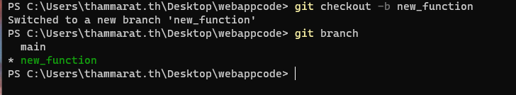

# HTML (Hypertext Markup Language)

* HTML เป็นภาษามาร์กอัปที่กำหนดโครงสร้างของเว็บเพจ โค้ดจะถูกตีความโดยเว็บเบราว์เซอร์ เช่น Safari, Google Chrome, Firefox ฯลฯ เพื่อแสดงเนื้อหาบนหน้าจอ
* เริ่มต้นด้วยการเขียนไฟล์ HTML อย่างง่าย!


```html
<!DOCTYPE html>
<html lang="en">
    <head>
        <title>Hello!</title>
    </head>
    <body>
        Hello, world!
    </body>
<html>
```


* เมื่อเราเปิดไฟล์นี้ในเบราว์เซอร์ เราจะได้รับ:

<figure><figcaption></figcaption></figure>

ตอนนี้ เรามาพูดถึงไฟล์ที่เราเพิ่งเขียน ซึ่งดูเหมือนจะค่อนข้างซับซ้อน สำหรับการเห็นครั้งแรก

* ในบรรทัดแรก เรากำลังประกาศ (ต่อเว็บเบราว์เซอร์) ว่าเรากำลังเขียนเอกสารใน HTML เวอร์ชันล่าสุด: HTML5
* หลังจากนั้น เพจจะประกอบด้วยองค์ประกอบ HTML (**HTML element**) ที่ซ้อนกัน (เช่น html และ body) แต่ละรายการมี**แท็กเปิดและแท็กปิด**ที่มีเครื่องหมาย **\<element>** สำหรับเปิดและ  **\</element>** สำหรับปิด
* สังเกตว่าองค์ประกอบภายในแต่ละรายการเยื้องออกไปไกลกว่าองค์ประกอบสุดท้ายเพียงเล็กน้อย แม้จะไม่จำเป็นสำหรับว่าเบราว์เซอร์ แต่การเขียนโค้ดแบบนี้ จะมีประโยชน์ช่วยในการอ่านได้ง่าย
* องค์ประกอบ HTML สามารถเพิ่มแอตทริบิวต์, **attributes** เพื่อให้รายละเอียดเพิ่มเติมเกี่ยวกับองค์ประกอบแก่เบราว์เซอร์ ตัวอย่างเช่น เมื่อเราใส่ lang="en" ในแท็กเริ่มต้น เรากำลังบอกเบราว์เซอร์ว่าเรากำลังใช้ภาษาอังกฤษเป็นภาษาหลัก
* ภายในองค์ประกอบ HTML โดยทั่วไปเราต้องการรวมแท็ก head และ body องค์ประกอบ head จะรวมข้อมูลเกี่ยวกับเพจของคุณที่ไม่จำเป็นต้องแสดง และองค์ประกอบ body จะมีสิ่งที่ผู้ใช้ที่เข้าชมไซต์สามารถมองเห็นได้จริง&#x20;
* ภายใน head เราได้มี title, หัวเรื่องสำหรับหน้าเว็บของคุณ ซึ่งคุณจะสังเกตเห็นว่าแสดงในแท็บที่ด้านบนของเว็บเบราว์เซอร์ของเรา
* สุดท้าย เราได้ใส่ข้อความ “Hello, world” ใน body ซึ่งเป็นส่วนที่มองเห็นได้ในหน้าของเรา
